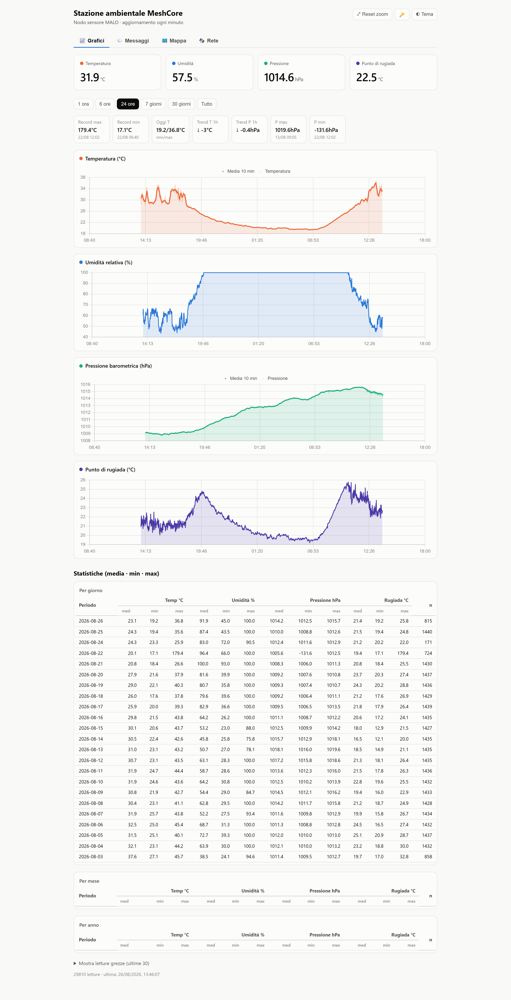
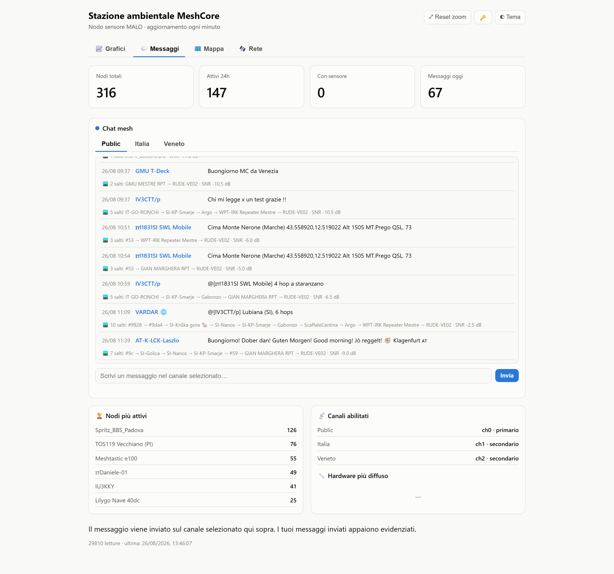
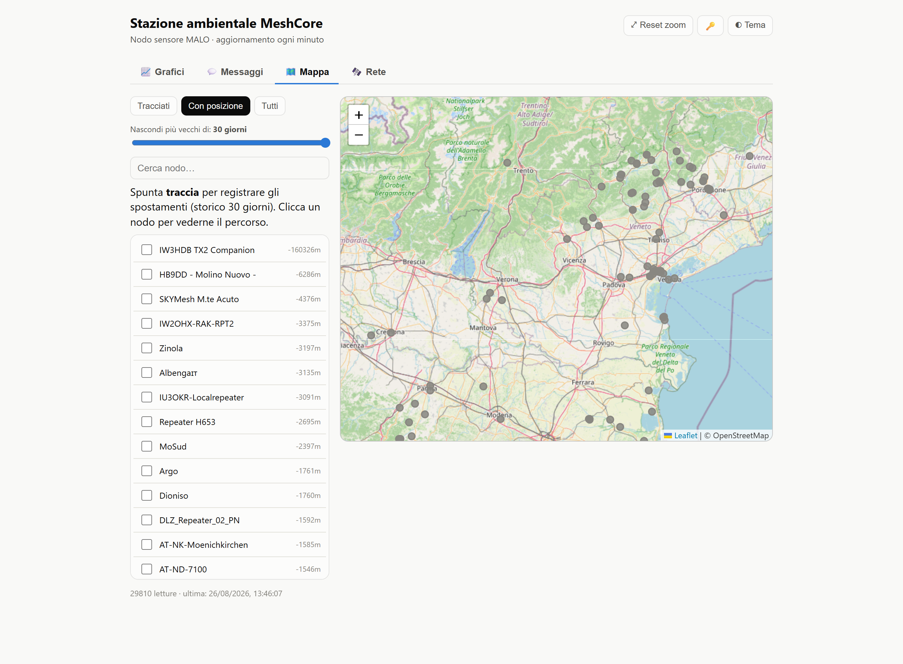
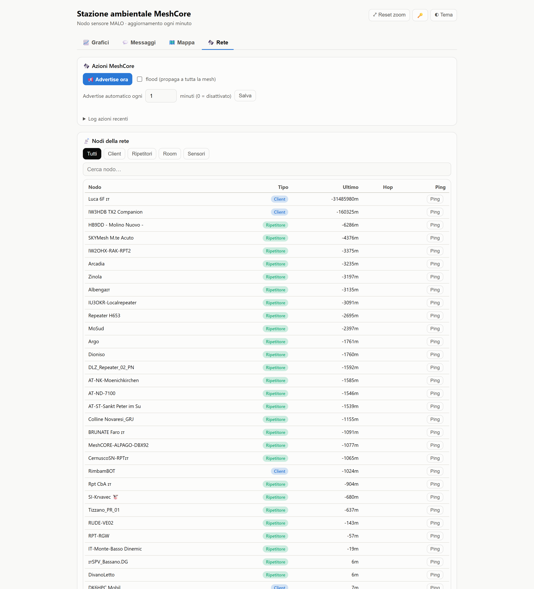

# Meshlogger

Stazione ambientale + monitor mesh **MeshCore** per Raspberry Pi (o qualsiasi Linux).
Logga **temperatura / umidità / pressione** da un nodo LoRa, mostra grafici e statistiche
su una **dashboard web**, gestisce la **chat dei canali** mesh (ricezione/invio) e una
**mappa dei nodi**.

> Nato su Meshtastic, ora convertito a **MeshCore**. Il vecchio logger Meshtastic
> (`logger.py`) è incluso ma non usato.

---

## La dashboard

La web app ha quattro sezioni (tab), tema chiaro/scuro e chiave API salvata nel browser.

### 📈 Grafici



Valori correnti (temperatura, umidità, pressione, punto di rugiada) e **quattro grafici**
con **zoom/pan** e **media mobile centrata a 10 minuti**. Selettore di periodo
(1h → tutto), striscia dei **record** (max/min assoluti, trend 1h) e **tabelle statistiche**
per giorno / mese / anno (media · min · max). Il punto di rugiada è calcolato dai dati.

### 💬 Messaggi



Chat dei canali mesh in stile chat (Public / Italia / Veneto come sotto-tab), ordine
cronologico con input in fondo e invio sul canale selezionato. Sotto ogni messaggio è
ricostruito il **percorso dei salti** (`N salti: Nodo → Nodo → … · SNR`) usando gli RX log
e le posizioni note dei nodi. In alto i contatori (nodi totali/attivi/messaggi), a fondo
pagina i **nodi più attivi** e i **canali abilitati**.

### 🗺️ Mappa



Mappa Leaflet + OpenStreetMap con i marker dei nodi. Filtri **Tracciati / Con posizione /
Tutti**, **slider età** (da 1h a 30 giorni), ricerca, flag *traccia* per registrare lo
storico spostamenti (30 giorni) e visualizzazione del **percorso** di un nodo cliccandolo.
Auto-refresh ogni 30s.

### 🛰️ Rete



Funzioni MeshCore: **Advertise** manuale (con opzione *flood*) e **advertise automatico**
ogni N minuti; **tabella dei nodi** con badge tipo (Client / Ripetitore / Room / Sensore),
filtro per tipo e ricerca; pulsante **Ping** per riga per il path discovery (ai companion
invia un messaggio "ping" e attende l'ACK, previo avviso). Log delle azioni recenti.

---

## Cosa serve

- Un nodo **MeshCore** raggiungibile via **TCP** (companion, tipicamente porta `5000`),
  **seriale** (USB) o **BLE**. Il sensore ambientale (es. BME280) deve essere sul nodo,
  esposto come telemetria LPP Cayenne.
- Un computer Linux sempre acceso (Raspberry Pi va benissimo) con **Python 3.11+**.
- (Facoltativo) un account **ngrok** per l'accesso da fuori casa.

---

## Installazione

```bash
# 1. Clona/copia i file in una cartella, es. /home/pi/meshlogger
cd /home/pi/meshlogger

# 2. Crea il virtualenv e installa le dipendenze
python3 -m venv venv
./venv/bin/pip install -r requirements.txt

# 3. Scarica le librerie front-end in static/ (vedi sotto)
```

### Librerie front-end (cartella `static/`)

La dashboard usa librerie JS/CSS **servite in locale** (nessuna CDN a runtime). Se la
cartella `static/` non è già popolata, scarica questi file dentro `static/`:

| File | Versione | Fonte (jsDelivr) |
|---|---|---|
| `chart.umd.min.js` | Chart.js 4.4.4 | `https://cdn.jsdelivr.net/npm/chart.js@4.4.4/dist/chart.umd.min.js` |
| `chartjs-plugin-zoom.min.js` | 2.0.1 | `https://cdn.jsdelivr.net/npm/chartjs-plugin-zoom@2.0.1/dist/chartjs-plugin-zoom.min.js` |
| `hammer.min.js` | 2.0.8 | `https://cdn.jsdelivr.net/npm/hammerjs@2.0.8/hammer.min.js` |
| `leaflet.js` | 1.9.4 | `https://cdn.jsdelivr.net/npm/leaflet@1.9.4/dist/leaflet.js` |
| `leaflet.css` | 1.9.4 | `https://cdn.jsdelivr.net/npm/leaflet@1.9.4/dist/leaflet.css` |

> La mappa scarica comunque i **tile OSM** da internet a runtime.

---

## Configurazione (variabili d'ambiente)

Non c'è nessun segreto nel codice: tutto passa da variabili d'ambiente.

### Logger (`logger_meshcore.py`)

| Variabile | Default | Descrizione |
|---|---|---|
| `MC_CONN` | `serial` | Tipo connessione: `tcp` \| `serial` \| `ble` |
| `MC_HOST` | — | (tcp) IP del nodo MeshCore |
| `MC_TCP_PORT` | `5000` | (tcp) porta companion |
| `MC_PORT` | `/dev/ttyACM0` | (serial) device |
| `MC_BAUD` | `115200` | (serial) baud |
| `MC_BLE_ADDR` / `MC_BLE_PIN` | — | (ble) indirizzo/PIN |
| `MC_SENSOR` | `self` | `self` = nodo collegato al Pi |
| `MESH_INTERVAL` | `60` | secondi tra una lettura e l'altra |
| `MESH_DB` | `./meshlogger.db` | percorso database SQLite |

### Web (`web.py`)

| Variabile | Default | Descrizione |
|---|---|---|
| `WEB_PORT` | `8080` | porta HTTP della dashboard |
| `API_KEY` | *(vuoto)* | chiave per `/api`. **Vuoto = API aperta** (solo LAN fidata). Genera con `openssl rand -hex 24` |
| `PRESSURE_OFFSET` | `11` | correzione pressione per l'altitudine locale (hPa). Metti `0` se non serve |
| `MESH_NODE_LABEL` | *(etichetta)* | nome del nodo sensore mostrato in dashboard |
| `MESH_DB` | `./meshlogger.db` | stesso DB del logger |

---

## Avvio manuale (test)

```bash
# Terminale 1 — logger (esempio TCP)
MC_CONN=tcp MC_HOST=<IP_NODO> MC_TCP_PORT=5000 MC_SENSOR=self \
  ./venv/bin/python logger_meshcore.py

# Terminale 2 — dashboard
WEB_PORT=8080 API_KEY=<tua-chiave> PRESSURE_OFFSET=0 \
  ./venv/bin/python web.py
```

Apri poi `http://<ip-del-pi>:8080`. In alto a destra il tasto 🔑 salva la chiave API
nel browser (localStorage).

> ⚠️ Il nodo MeshCore accetta **un solo client TCP** alla volta: se il logger è in
> esecuzione, non puoi collegarti al nodo con un altro script/app contemporaneamente.

---

## Avvio come servizi (systemd)

Nella cartella `systemd/` ci sono i **template** dei tre servizi. Per installarli:

```bash
sudo cp systemd/meshcorelogger.service /etc/systemd/system/
sudo cp systemd/meshweb.service        /etc/systemd/system/
sudo cp systemd/meshngrok.service      /etc/systemd/system/   # facoltativo
# → modifica ogni file mettendo i tuoi valori (<IP...>, <API_KEY>, ...)
sudo nano /etc/systemd/system/meshweb.service

sudo systemctl daemon-reload
sudo systemctl enable --now meshcorelogger meshweb
sudo systemctl enable --now meshngrok      # solo se usi ngrok

# stato / log
systemctl is-active meshcorelogger meshweb
journalctl -u meshcorelogger -n 30
```

Dopo aver modificato `web.py` o `templates/index.html`: `sudo systemctl restart meshweb`.
Dopo aver modificato `logger_meshcore.py`: `sudo systemctl restart meshcorelogger`.

---

## Struttura del progetto

```
logger_meshcore.py      # daemon MeshCore (telemetria + chat + nodi/mappa)
web.py                  # backend Flask + API (servito con waitress)
templates/index.html    # dashboard (HTML/CSS/JS inline)
static/                 # librerie JS/CSS locali (da scaricare, vedi sopra)
systemd/                # template dei servizi systemd
docs/img/               # screenshot per questo README
requirements.txt
CLAUDE.md               # note tecniche / quirk del progetto (valori sensibili come placeholder)
```

Il database `meshlogger.db` (SQLite) viene creato al primo avvio.

---

## Note per chi testa

- I **canali** mesh (con le loro chiavi) vengono letti dal nodo MeshCore: configurali
  sul nodo con l'app ufficiale MeshCore, non qui.
- Per l'accesso remoto via ngrok le fetch aggiungono l'header
  `ngrok-skip-browser-warning: true` per saltare l'interstitial del piano free.
- La telemetria del BME può arrivare a intermittenza: il logger ritenta più volte a
  ogni ciclo finché ottiene il canale con umidità/pressione.

---

## Cosa **non** è incluso (e non va condiviso)

Questi elementi contengono dati privati o sono specifici della tua installazione — ognuno
deve generarseli/configurarseli:

- `meshlogger.db` (i tuoi dati e messaggi)
- `venv/` (ambiente Python locale)
- la **chiave API** reale, il **token ngrok** (`~/.config/ngrok/ngrok.yml`) e il tuo
  **dominio ngrok**
- eventuali **chiavi SSH** e chiavi dei canali mesh

Il codice non contiene nessuno di questi valori: li fornisci tu via variabili d'ambiente.
```
